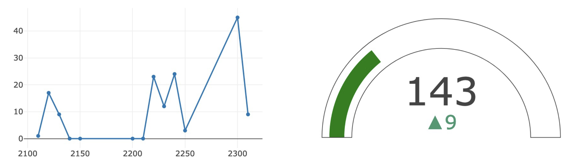

This application is a web-based pedometer.

The hardware part includes a mircro:bit for sensoring.

The web app is based on JavaScript.

Database is set in Google Cloud Firebase. The communication between micro:bit and app is using bluetooth.

